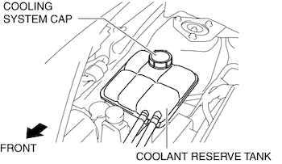
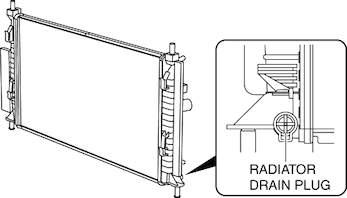

# Engine Cooler Fluid

__WARNING:__

* Never remove the cooling system cap or loosen the radiator drain plug while the engine is running, or when the engine and radiator are hot. Scalding engine coolant and steam may shoot out and cause serious injury. It may also damage the engine and cooling system.
* Turn off the engine and wait until it is cool. Even then, be very careful when removing the cap. Wrap a thick cloth around it and slowly turn it counterclockwise 2.5 turns. Step back while the pressure escapes.
* When you are sure all the pressure is gone, turn the cap using the cloth, and remove it.

## Fluid Replacement

1) Remove the cooling system cap.  

2) Loosen the radiator drain plug and drain the engine coolant into a container. 

3) Flush the cooling system with water until all traces of color are gone. 

4) Let the system drain completely. 

5) Tighten the radiator drain plug. 

6) Referring to the following chart, select the correct volume percentage of the water and engine coolant. **Antifreeze solution mixture percentage**

7) Refill the engine coolant into the coolant reserve tank up to the MAX mark on the tank. 

8) Install the cooling system cap. 

__CAUTION:__

* If the high engine coolant temperature warning light flashes, stop the engine to lower the engine coolant temperature and prevent overheating. Then, verify the malfunctioning part and repair or replace it.
* If the engine coolant level in the coolant reserve tank is below the MIN mark during engine coolant air bleeding operation, stop the engine, and after the engine coolant temperature decreases, add engine coolant. Then, resume the engine coolant air bleeding operation.

9) Start the engine and warm up the engine by idling. 

10) Bleed the air by following the procedures below. At this time, be careful of the coolant temperature to prevent overheating. 
