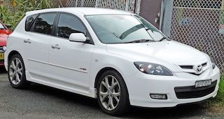

# The Mazda 3
Mazda 3 (known as the Mazda Axela in Japan (first three generations), a combination of "accelerate" and "excellent") is a compact car manufactured in Japan by **Mazda**. It was introduced in 2003 as a 2004 model, replacing the Familia/323/Protegé in the C-segment. A performance-oriented version of the Mazda3 was marketed as the Mazdaspeed3 in North America, Axela in Japan, and the Mazda 3 MPS in Europe.

A second-generation Mazda 3 for the 2009 model year was unveiled in late 2008, with the sedan premièring at the Los Angeles Auto Show and the hatchback at the Bologna Motor Show. For the 2012 model year, Mazda began offering the Mazda 3 with their newly-developed SkyActiv technology, including a more rigid body, a new direct-injection engine, and a new 6-speed transmission.

 

The third generation was introduced in mid-2013 as a 2014 model.

A fourth-generation Mazda 3 for the 2019 model year was unveiled in November 2018 at the Los Angeles Auto Show and the ASEAN premiere at the Singapore Motor Show. For the 2019 model, the all-new Mazda3 is equipped with the newly-developed SkyActiv technology, including the latest SkyActiv-X, SkyActiv-G and SkyActiv-D engines, each of which provides responsive speed control in any driving situation, and a Spark-Controlled Compression Ignition system.

The Mazda3 became Mazda's fastest-selling vehicle in January 2019, with cumulative sales of over 6 million units.

[Read More](https://en.wikipedia.org/wiki/Mazda3)
