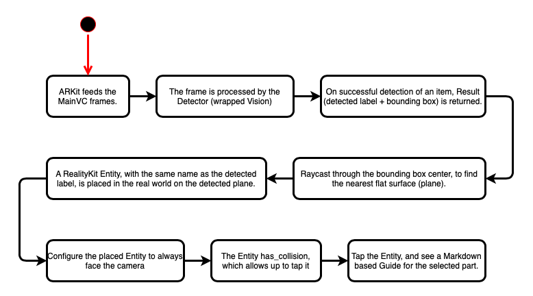

# ARCarGuidePoC

Detects parts under a hood of a motor vehicle, and tracks the detected parts in AR. 
Tap AR entities to get more information about the part.

This is a PoC project, designed to detect a handful of Mazda 3 parts.

- `ARKit`.
- `Vision` with a self taught `CoreML` model.
- `RealityKit` with `RealityComposer`.

## App Demo

## App Flow

<h4>Feel free to suggest ideas to make this more than just a PoC</h4>

Cheers! 🎈

